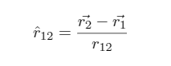

# Segunda Ley de Newton

Esta ley nos dice que la aceleración de un cuerpo es proporcional a la fuerza que se le ejerce. La constante que relaciona estas dos magnitudes es la masa del cuerpo y matemáticamente se expresa de la siguiente manera:

# Ley de la Gravitación Universal

Expresa que dos cuerpos presentan una atracción proporcional al producto de sus masas (m_1 e m_2)e inversamente proporcional al cuadrado de la distancia (euclidiana) que los separa (r_12). La constante de proporcionalidad que relaciona la fuerza de atracción con las masas y el inverso de su distancia, es la conocida como constante de la gravitación universal G. La ecuación tiene la siguiente forma:

La expresión anterior solo tiene en cuenta la magnitud, para volverlo un vector se usa la definición de vector unitario:

Utilizando la Segunda Ley de Newton

Dividiendo por la m_1

Para la m_2

